# Splunk-project

# Triển khai và Điều tra Sự cố với SIEM Splunk

## 1. Cài đặt môi trường
 **Máy chủ Linux (Splunk):** IP 192.168.2.10, cổng nhận log 9997. Cài đặt TA windows addon for sysmon, splunk addon for microsoft windows, splunk CIM. Tạo index `sysmon` và `windows_clientA`.

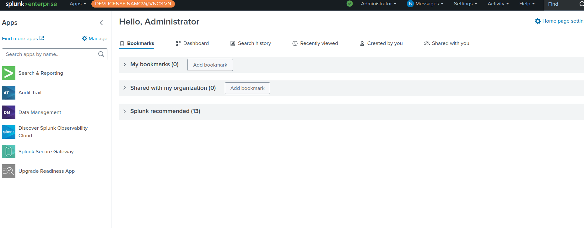

* **Máy client (Windows 10):** IP 192.168.2.5, cài Splunk Universal Forwarder. Cấu hình file `inputs.conf` và `outputs.conf` để đẩy log.

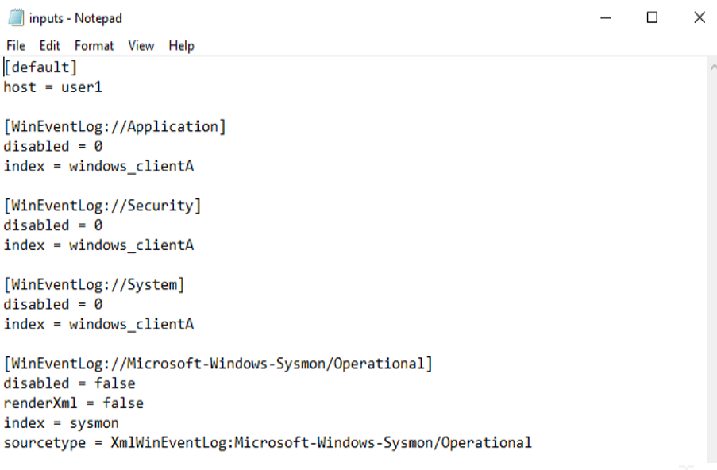
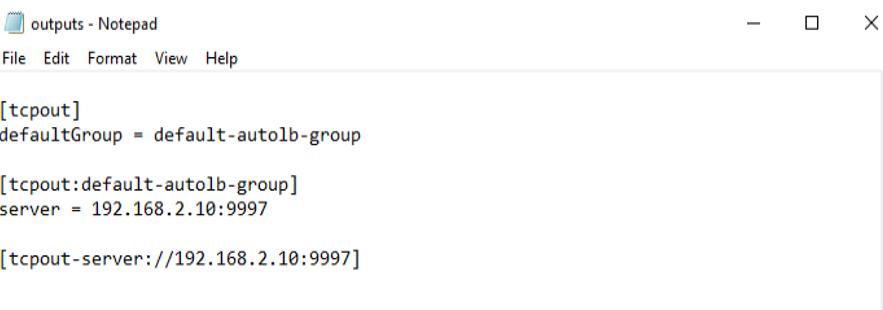

* **Kiểm tra Log:** Log trả về thành công.

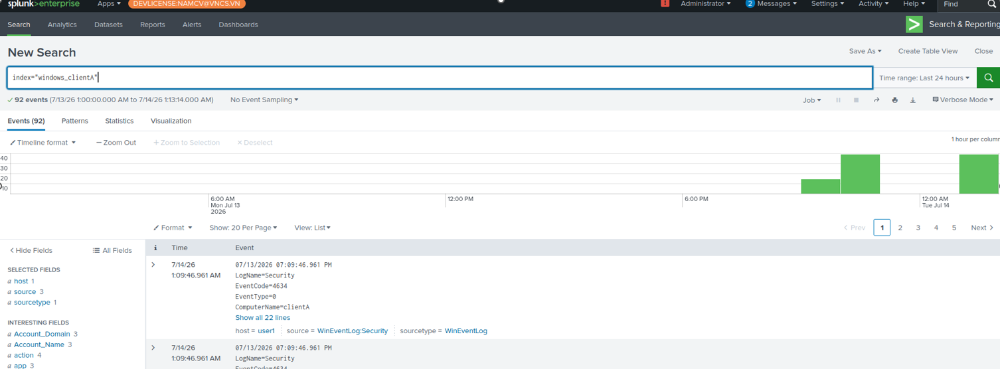

## 2. Kịch bản mô phỏng tấn công
* Kẻ tấn công host HTTP server tại `192.168.2.10:5000` chứa file giả mạo `update.exe`.

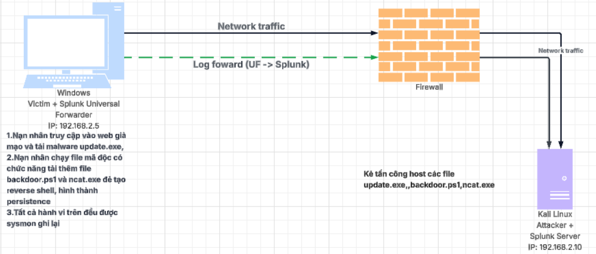

* Người dùng tải và chạy `update.exe`, file này bí mật tải `backdoor.ps1` và `ncat.exe` vào `C:\Users\admin\AppData\Local\Temp\MicrosoftUpdates`.

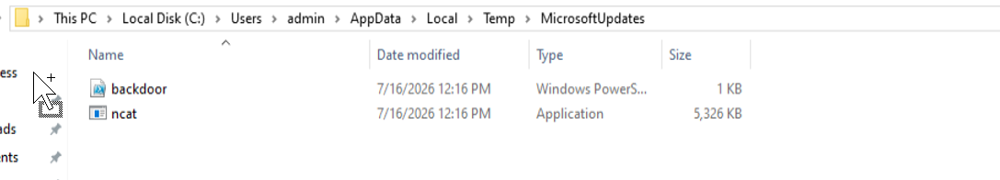

* Malware thiết lập persistence bằng cách thêm giá trị vào Registry Run Key: `HKCU:\Software\Microsoft\Windows\CurrentVersion\Run`.

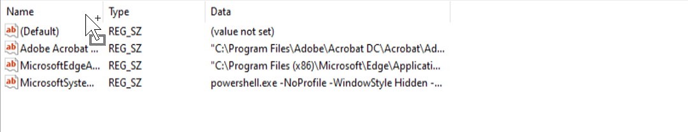

## 3. Xây dựng Rule phát hiện (MITRE ATT&CK - T1547.001)

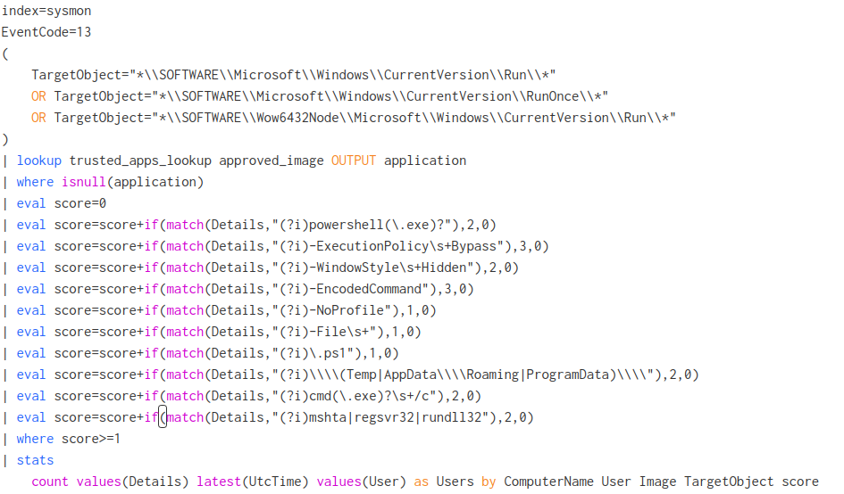

* **Phát hiện tương tác với các Registry Run Key, lọc các app hợp lệ dựa trên bảng lookup cấu hình từ trước, sử dụng cơ chế tính điểm để lọc ra các event chạy script có nhiều tham số, trường lệnh nhạy cảm :**
index=sysmon
EventCode=13
(
    TargetObject="*\\SOFTWARE\\Microsoft\\Windows\\CurrentVersion\\Run\\*"
    OR TargetObject="*\\SOFTWARE\\Microsoft\\Windows\\CurrentVersion\\RunOnce\\*"
    OR TargetObject="*\\SOFTWARE\\Wow6432Node\\Microsoft\\Windows\\CurTrentVersion\\Run\\*"
)
| lookup trusted_apps_lookup approved_image OUTPUT application
| where isnull(application)
| eval score=0
| eval score=score+if(match(Details,"(?i)powershell(\.exe)?"),2,0)
| eval score=score+if(match(Details,"(?i)-ExecutionPolicy\s+Bypass"),3,0)
| eval score=score+if(match(Details,"(?i)-WindowStyle\s+Hidden"),2,0)
| eval score=score+if(match(Details,"(?i)-EncodedCommand"),3,0)
| eval score=score+if(match(Details,"(?i)-NoProfile"),1,0)
| eval score=score+if(match(Details,"(?i)-File\s+"),1,0)
| eval score=score+if(match(Details,"(?i)\.ps1"),1,0)
| eval score=score+if(match(Details,"(?i)\\\\(Temp|AppData\\\\Roaming|ProgramData)\\\\"),2,0)
| eval score=score+if(match(Details,"(?i)cmd(\.exe)?\s+/c"),2,0)
| eval score=score+if(match(Details,"(?i)mshta|regsvr32|rundll32"),2,0)
| where score>=1
| stats
    count values(Details) latest(UtcTime) values(User) as Users by ComputerName User Image TargetObject score
* **Phát hiện kết nối C2:**
  `index="sysmon" EventCode=3 DestinationPort=4444`

## 4. Điều tra và phân tích kết quả trên Splunk
* **Phát hiện Persistence:** EventCode 13 ghi nhận `update.exe` sửa Registry, chèn lệnh PowerShell chạy `backdoor.ps1` ẩn (`-WindowStyle Hidden -ExecutionPolicy Bypass`).

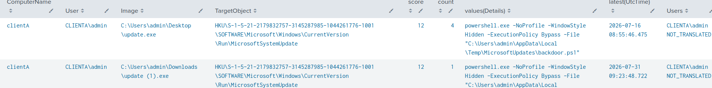

* **Truy xuất nguồn gốc:** EventCode 1 ghi nhận `update.exe` sinh ra từ `explorer.exe`. 

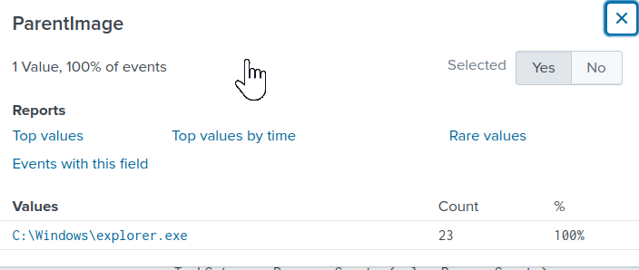

EventCode 11 và luồng `Zone.Identifier` xác nhận file tải về từ Internet qua trình duyệt Edge (URL: `http://192.168.2.10:5000/update.exe`).

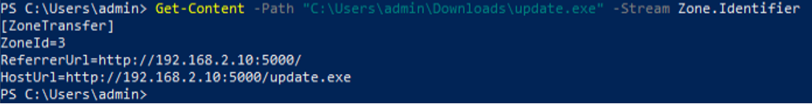

* **Phân tích hành vi file:** EventCode 11 cho thấy `update.exe` trực tiếp sinh ra hai file `ncat.exe` và `backdoor.ps1` trong thư mục Temp.

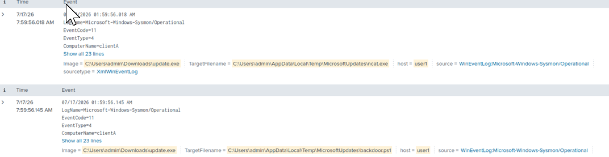

* **Xác nhận thực thi:** Đối chiếu EventCode 4624 (Logon) và EventCode 1 (Process Create), PowerShell kích hoạt `backdoor.ps1` thành công ngay khi người dùng đăng nhập lại, do `explorer.exe` gọi từ Run Key.

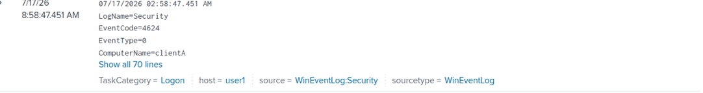

* **Phát hiện kết nối C2 (Network):**

